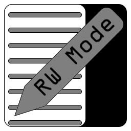
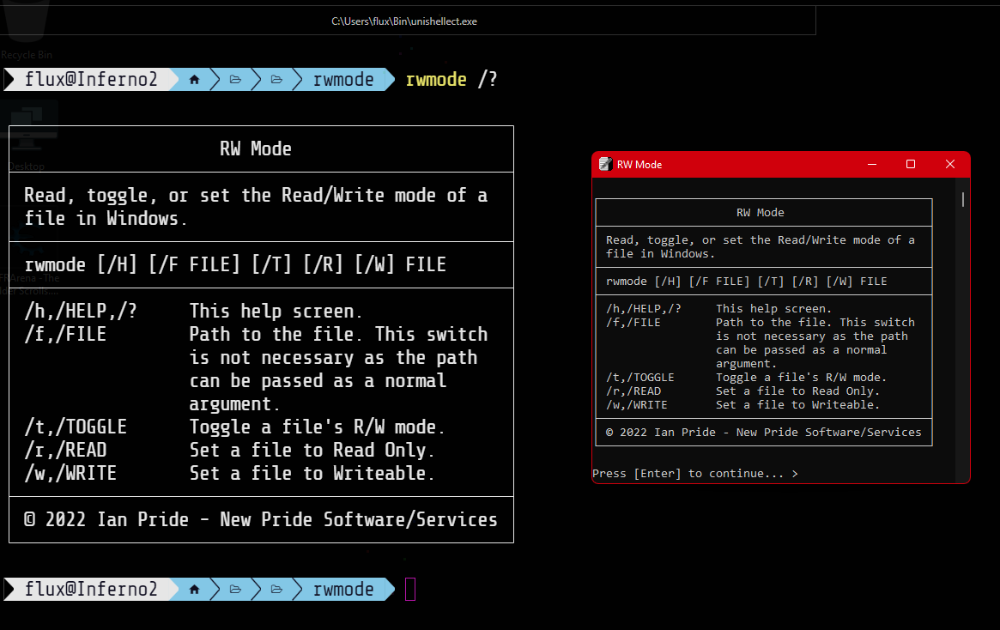

# RW Mode

Read, toggle, or set a file&#39;s Read&#47;Write mode in Windows&#46;

- [RW Mode](#rw-mode)
  - [About](#about)
    - [Description](#description)
    - [Motivation](#motivation)
    - [Where To Get](#where-to-get)
  - [Usage](#usage)
    - [Environment and Information](#environment-and-information)
    - [Examples](#examples)
  - [MD5 Information](#md5-information)
    - [Current X86 MD5](#current-x86-md5)
    - [Current X64 MD5](#current-x64-md5)
  - [Media](#media)
  - [LICENSE](#license)

---

## About

All about this program and project&#46;

### Description

  
What is this&#63;

  

  This is a console tool for the <b>Windows</b> command line environment that allows you to read, toggle, or set a file&#39;s Read&#47;Write mode in Windows&#46;
  

### Motivation

  
Why did I write this&#63;

  

    I often change the read&#47;write state of file&#39;s in Windows&#59; for example I keep my <i>hosts</i> file set to <i>Read Only</i>&#44; but change it to <i>Writeable</i> when I update and compress to my custom <i>hosts</i> file&#46;
  

### Where To Get

  
Download or build&#46;

  

  You can fork this repository and build yourself or you can download it at the current <a href="https://github.com/Lateralus138/rwmode/releases">Releases</a> page&#46;

  You can &#40;as with any of my projects&#41; fork and build this project yourself in keeping with the provided <a href="#LICENSE" >LICENSE</a> below.
  

---

## Usage

Where and how to use this program&#46;

### Environment and Information

  
Where do I use this&#63;

  

  Like any cli tool &#40;or any executable for that matter&#41; this can be used in any available command line program&#47;emulator in <b>Windows</b> like <b>CMD</b> or <b>PowerShell</b>&#44; for example&#44; and should work in most available terminals&#46;

  Like any portable program in this can either be placed somewhere in your <code>%PATH%</code> and if not then when your run it you&#39;ll need to provide the direct path of the executable&#46;
  

  <h4>Example Given</h4>
  <pre>
    <code> > & &#39;C:\Users\&#60;USERNAME&#62;\Bin\rwmode.exe&#39; /&#63; </code>
  </pre>

### Examples

  
Best methods&#46;

  

  This is best used as a <i>scheduled task</i> via <i><b>Task Scheduler</b></i> with the &#91;&#47;P&#93; switch&#44; but you can use it from the command line&#44; shortcut &#40;&#46;lnk&#41;&#44; clicked&#44; or from any other program&#46;
  

  
Get Help&#46;

  
In CMD or PowerShell&#46; &#40;with /?, /H, or /HELP&#41;&#46; You can also find a screenshot below&#46;

  <pre>
    <code>C:\Windows\System32> rwmode /?</code>
    <samp>
┌────────────────────────────────────────────────┐
│                    RW Mode                     │
├────────────────────────────────────────────────┤
│ Read, toggle, or set the ReaRW Moderite mode of a  │
│ file in Windows.                               │
├────────────────────────────────────────────────┤
│ rwmode [/H] [/F FILE] [/T] [/R] [/W] FILE      │
├────────────────────────────────────────────────┤
│ /h,/HELP,/?     This help screen.              │
│ /f,/FILE        Path to the file. This switch  │
│                 is not necessary as the path   │
│                 can be passed as a normal      │
│                 argument.                      │
│ /t,/TOGGLE      Toggle a file's R/W mode.      │
│ /r,/READ        Set a file to Read Only.       │
│ /w,/WRITE       Set a file to Writeable.       │
├────────────────────────────────────────────────┤
│ © 2022 Ian Pride - New Pride Software/Services │
└────────────────────────────────────────────────┘
    </samp>
  </pre>

  
CMD/PowerShell Examples&#46;

  
Get Read&#47;Write state of the Windows hosts file&#46;

  <pre>
  <code>
  C:\Windows\System32> rwmode /f C:\Windows\System32\drivers\etc\hosts
  <samp>
     "C:\\Windows\\System32\\drivers\\etc\\hosts" is currently: [Read Only].                
  </samp>
  </code>
  </pre>
  
Toggle Read&#47;Write state of the Windows hosts file&#46;

  <pre>
  <code>
  C:\Windows\System32> rwmode /f C:\Windows\System32\drivers\etc\hosts /t
  <samp>
    "C:\\Windows\\System32\\drivers\\etc\\hosts" is currently: [Read Only].
    Attempting to toggle the Read/Write mode of "C:\\Windows\\System32\\drivers\\etc\\hosts"
    "C:\\Windows\\System32\\drivers\\etc\\hosts" is currently: [Writeable].               
  </samp>
  </code>
  </pre>

---

## MD5 Information

This information is generated in a *GitHub Action* immediately after the successful build of this project.

### Current X86 MD5

### Current X64 MD5

---

## Media

<!-- ### Logo -->

  
Logo, the icon for this program&#46; 

  

  
Help, screenshot of the help screen&#46; 

  

<!-- ### Example Screenshots -->

---

## [LICENSE](./LICENSE)

  
License Excerpt

   
  <blockquote>
  This program is free software&#58; you can redistribute it and&#47;or modify it under the terms of the GNU General Public License as published by the Free Software Foundation&#44; either version 3 of the License&#44; or &#40;at your option&#41; any later version&#46;
  </blockquote>
   
  <blockquote>
  This program is distributed in the hope that it will be useful&#44; but WITHOUT ANY WARRANTY&#59; without even the implied warranty of MERCHANTABILITY or FITNESS FOR A PARTICULAR PURPOSE&#46;  See the GNU General Public License for more details&#46;
  </blockquote>

---

If you like this project and care to donate to my ***PayPal***:

Or ***Buy Me A Coffee*** if your prefer:

